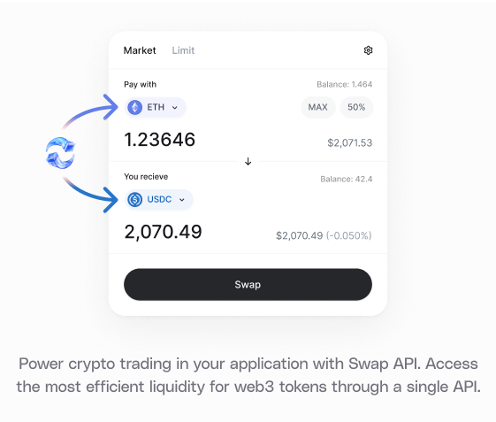

<Warning>
⚠️ The **Permit2** flow is intended for **advanced integrators only**.

If you're new to 0x Swap API or want to avoid the double-signature UX, consider using [AllowanceHolder](/docs/swap-api/guides/build-token-swap-d-app-next-js) instead.

</Warning>

## About Swap API

Swap API is a DEX aggregation and smart order routing REST API that finds the best price for crypto trades. With one API integration, you can easily add trading to your app. Swap API aggregates liquidity from 150+ sources , including AMMs and professional market makers, across the [supported chains](/docs/introduction/supported-chains).



The API handles three key tasks:

- Queries ERC20 prices from decentralized exchanges and market makers
- Aggregates liquidity for the best possible price
- Returns a trade format executable via your preferred web3 library

## What You Will Learn

This guide will cover the core steps to using Swap API, specifically using the [Swap Permit2](/api-reference#tag/Swap/operation/swap::permit2::getPrice) endpoint.

<Note>
  Learn about the [difference between Permit2 and AllowanceHolder in Swap
  API](/docs/introduction/faq#allowanceholder-and-permit2)
</Note>

## Try It Out

### Example Code

<Tip>
  Follow along locally with the code example:
  https://github.com/0xProject/0x-examples/tree/main/swap-v2-permit2-headless-example
</Tip>

### Playground

Try this code example directly in your browser—no installation needed!

<iframe
  frameborder="0"
  width="100%"
  height="500px"
  src="https://replit.com/@0xproject/0x-Swap-API-v2-Permit2-Headless-Example?embed=true"
></iframe>

## Swap Token in 6 Steps

0. Get a 0x API key
1. Get an indicative price
2. (If needed) Set token allowance
3. Fetch a firm quote
4. Sign the Permit2 EIP-712 message
5. Append signature length and signature data to calldata
6. Submit the transaction with Permit2 signature

## 0. Get a 0x API key

Every 0x API call requires an API key. [Create a 0x account](https://dashboard.0x.org/) to get your live API key. Follow the [setup guide](/docs/introduction/quickstart/create-a-0x-api-key) for more details.

## 1. Get an Indicative Price

Let's find the best price!

Use the [`/swap/permit2/price`](/api-reference/openapi-yaml/swap/permit-2-getprice) endpoint to get an indicative price for an asset pair. This returns pricing information without creating a full order or transaction, allowing the user to browse potential prices before committing.

Think of `/price` as the "read-only" version of `/quote`, which you'll use in step 3.

### Example Request

Here is an example request to sell 100 WETH for DAI using `/price`.

See ([code example](https://github.com/0xProject/0x-examples/blob/main/swap-v2-permit2-headless-example/index.ts#L88-L108)).

```js
const priceParams = new URLSearchParams({
  chainId: "1", // / Ethereum mainnet. See the 0x Cheat Sheet for all supported endpoints: https://0x.org/docs/core-concepts/0x-cheat-sheet
  sellToken: "0xc02aaa39b223fe8d0a0e5c4f27ead9083c756cc2", //ETH
  buyToken: "0x6b175474e89094c44da98b954eedeac495271d0f", //DAI
  sellAmount: "100000000000000000000", // Note that the WETH token uses 18 decimal places, so `sellAmount` is `100 * 10^18`.
  taker: "$USER_TAKER_ADDRESS", //Address that will make the trade
});

const headers = {
  "0x-api-key": "[api-key]", // Get your live API key from the 0x Dashboard (https://dashboard.0x.org/apps)
  "0x-version": "v2",
};

const priceResponse = await fetch(
  "https://api.0x.org/swap/permit2/price?" + priceParams.toString(),
  { headers }
);

console.log(await priceResponse.json());
```

### Example Response

You will receive a response that looks like this:

<Accordion title="Expand to see response">

```json
{
  "allowanceTarget": "0x000000000022d473030f116ddee9f6b43ac78ba3",
  "blockNumber": "23234913",
  "buyAmount": "457361651612757197478240",
  "buyToken": "0x6b175474e89094c44da98b954eedeac495271d0f",
  "fees": {
    "integratorFee": null,
    "zeroExFee": {
      "amount": "687073014602804210172",
      "token": "0x6b175474e89094c44da98b954eedeac495271d0f",
      "type": "volume"
    },
    "gasFee": null
  },
  "gas": "1276189",
  "gasPrice": "1528346162",
  "issues": {
    "allowance": {
      "actual": "0",
      "spender": "0x000000000022d473030f116ddee9f6b43ac78ba3"
    },
    "balance": {
      "token": "0xc02aaa39b223fe8d0a0e5c4f27ead9083c756cc2",
      "actual": "0",
      "expected": "100000000000000000000"
    },
    "simulationIncomplete": false,
    "invalidSourcesPassed": []
  },
  "liquidityAvailable": true,
  "minBuyAmount": "452781164365759128399840",
  "route": {
    "fills": [
      {
        "from": "0xc02aaa39b223fe8d0a0e5c4f27ead9083c756cc2",
        "to": "0xa0b86991c6218b36c1d19d4a2e9eb0ce3606eb48",
        "source": "Uniswap_V3",
        "proportionBps": "500"
      },
      {
        "from": "0xc02aaa39b223fe8d0a0e5c4f27ead9083c756cc2",
        "to": "0xa0b86991c6218b36c1d19d4a2e9eb0ce3606eb48",
        "source": "Uniswap_V3",
        "proportionBps": "2919"
      },
      {
        "from": "0xc02aaa39b223fe8d0a0e5c4f27ead9083c756cc2",
        "to": "0xa0b86991c6218b36c1d19d4a2e9eb0ce3606eb48",
        "source": "Uniswap_V4",
        "proportionBps": "250"
      },
      {
        "from": "0xc02aaa39b223fe8d0a0e5c4f27ead9083c756cc2",
        "to": "0xa0b86991c6218b36c1d19d4a2e9eb0ce3606eb48",
        "source": "Uniswap_V4",
        "proportionBps": "250"
      },
      {
        "from": "0xc02aaa39b223fe8d0a0e5c4f27ead9083c756cc2",
        "to": "0xa0b86991c6218b36c1d19d4a2e9eb0ce3606eb48",
        "source": "0x_RFQ",
        "proportionBps": "1916"
      },
      {
        "from": "0xc02aaa39b223fe8d0a0e5c4f27ead9083c756cc2",
        "to": "0xa0b86991c6218b36c1d19d4a2e9eb0ce3606eb48",
        "source": "0x_RFQ",
        "proportionBps": "2166"
      },
      {
        "from": "0xc02aaa39b223fe8d0a0e5c4f27ead9083c756cc2",
        "to": "0xdac17f958d2ee523a2206206994597c13d831ec7",
        "source": "Swaap_V2",
        "proportionBps": "1252"
      },
      {
        "from": "0xc02aaa39b223fe8d0a0e5c4f27ead9083c756cc2",
        "to": "0xdac17f958d2ee523a2206206994597c13d831ec7",
        "source": "Uniswap_V3",
        "proportionBps": "249"
      },
      {
        "from": "0xc02aaa39b223fe8d0a0e5c4f27ead9083c756cc2",
        "to": "0xdac17f958d2ee523a2206206994597c13d831ec7",
        "source": "Uniswap_V3",
        "proportionBps": "249"
      },
      {
        "from": "0xc02aaa39b223fe8d0a0e5c4f27ead9083c756cc2",
        "to": "0xdac17f958d2ee523a2206206994597c13d831ec7",
        "source": "Uniswap_V4",
        "proportionBps": "249"
      },
      {
        "from": "0xdac17f958d2ee523a2206206994597c13d831ec7",
        "to": "0xa0b86991c6218b36c1d19d4a2e9eb0ce3606eb48",
        "source": "Ekubo",
        "proportionBps": "1999"
      },
      {
        "from": "0xa0b86991c6218b36c1d19d4a2e9eb0ce3606eb48",
        "to": "0x6b175474e89094c44da98b954eedeac495271d0f",
        "source": "Uniswap_V3",
        "proportionBps": "75"
      },
      {
        "from": "0xa0b86991c6218b36c1d19d4a2e9eb0ce3606eb48",
        "to": "0x6b175474e89094c44da98b954eedeac495271d0f",
        "source": "Maker_PSM",
        "proportionBps": "9925"
      }
    ],
    "tokens": [
      {
        "address": "0xc02aaa39b223fe8d0a0e5c4f27ead9083c756cc2",
        "symbol": "WETH"
      },
      {
        "address": "0xdac17f958d2ee523a2206206994597c13d831ec7",
        "symbol": "USDT"
      },
      {
        "address": "0xa0b86991c6218b36c1d19d4a2e9eb0ce3606eb48",
        "symbol": "USDC"
      },
      {
        "address": "0x6b175474e89094c44da98b954eedeac495271d0f",
        "symbol": "DAI"
      }
    ]
  },
  "sellAmount": "100000000000000000000",
  "sellToken": "0xc02aaa39b223fe8d0a0e5c4f27ead9083c756cc2",
  "tokenMetadata": {
    "buyToken": {
      "buyTaxBps": "0",
      "sellTaxBps": "0"
    },
    "sellToken": {
      "buyTaxBps": "0",
      "sellTaxBps": "0"
    }
  },
  "totalNetworkFee": "1950458560136618",
  "zid": "0x8deeaf238ca7e5548bc00202"
}
```

</Accordion>

## 2. Set a Token Allowance

Before proceeding with the swap, you'll need to set a token allowance.

A [token allowance](https://help.matcha.xyz/en/articles/8928084-what-are-token-allowances) lets a third party move your tokens on your behalf. Approve an allowance for the [Permit2 contract](https://github.com/Uniswap/permit2) - do not approve the Settler contract.

Specify the amount of ERC20 tokens the contract can move.

For implementation details, see [how to set your token allowances](/docs/swap-api/additional-topics/how-to-set-token-allowances).

<Note>
- NEVER set an allowance on the [Settler contract](/docs/core-concepts/0x-cheat-sheet#0x-settler-contracts). Doing so may result in unintended consequences, including potential loss of tokens or exposure to security risks. The Settler contract does not support or require token allowances for its operation. Setting an allowance on the Settler contract will lead to misuse by other parties.

- ONLY set allowances on [AllowanceHolder](/docs/core-concepts/0x-cheat-sheet#allowanceholder-contract) or [Permit2](/docs/core-concepts/0x-cheat-sheet#permit2-contract) contracts, as indicated by the API responses.

- The correct allowance target is returned in `issues.allowance.spender` or `allowanceTarget`.

</Note>

<Tip>
  When setting the token allowance, make sure to provide enough allowance for
  the buy or sell amount _as well as the gas;_ otherwise, you may receive a 'Gas
  estimation failed' error.
</Tip>

### Example Code

Here is an example of how to check and set token approvals.

See [code example](https://github.com/0xProject/0x-examples/blob/main/swap-v2-permit2-headless-example/index.ts#L113-L133).

```ts
// Note abi and client setup not shown in this snippet

// Check if taker needs to set an allowance for Permit2
// If the sellToken is a native token (e.g. ETH), skip allowance
if (sellToken.address === CONTRACTS.ETH) {
  console.log("Native token detected, no need for allowance check");
} else {
  // Check if allowance is required
  if (price.issues.allowance !== null) {
    try {
      const { request } = await sellToken.simulate.approve([
        price.issues.allowance.spender,
        maxUint256,
      ]);
      console.log("Approving Permit2 to spend sellToken...", request);
      // Set approval
      const hash = await sellToken.write.approve(request.args);
      console.log(
        "Approved Permit2 to spend sellToken.",
        await client.waitForTransactionReceipt({ hash })
      );
    } catch (error) {
      console.log("Error approving Permit2:", error);
    }
  } else {
    console.log("sellToken already approved for Permit2");
  }
}
```

## 3. Fetch a Firm Quote

When you're ready to execute a trade, request a firm quote from the Swap API using [`/swap/permit2/quote`](/api-reference/openapi-yaml/swap/permit-2-getquote). This signals a soft commitment to complete the trade.

The response includes a full 0x order, ready for submission to the network. The Market Maker is expected to have reserved the necessary assets, reducing the likelihood of order reversion.

### Example Request

Here is an example to fetch a firm quote sell 100 WETH for DAI using `/quote`.

See [code example](https://github.com/0xProject/0x-examples/blob/main/swap-v2-permit2-headless-example/index.ts#L135-L148).

```javascript
const qs = require('qs');

const params = {
    sellToken: '0xc02aaa39b223fe8d0a0e5c4f27ead9083c756cc2', //WETH
    buyToken: '0x6b175474e89094c44da98b954eedeac495271d0f', //DAI
    sellAmount: '100000000000000000000', // Note that the WETH token uses 18 decimal places, so `sellAmount` is `100 * 10^18`.
    taker: '$USER_TAKER_ADDRESS', // Address that will make the trade
    chainId: '1', // Ethereum mainnet. See the 0x Cheat Sheet for all supported endpoints: https://0x.org/docs/core-concepts/0x-cheat-sheet
};

const headers = {
    '0x-api-key': '[api-key]',  // Get your live API key from the 0x Dashboard (https://dashboard.0x.org/apps)
    '0x-version': 'v2',         // Add the version header
};

const response = await fetch(
    `https://api.0x.org/swap/permit2/quote?${qs.stringify(params)}`, { headers }
); /

console.log(await response.json());
```

### Example Response

You will receive a response that looks like this:

<Accordion title="Expand to see response">

```json
{
  "allowanceTarget": "0x000000000022d473030f116ddee9f6b43ac78ba3",
  "blockNumber": "23234917",
  "buyAmount": "457372248072383000000000",
  "buyToken": "0x6b175474e89094c44da98b954eedeac495271d0f",
  "fees": {
    "integratorFee": null,
    "zeroExFee": {
      "amount": "687212589007049771188",
      "token": "0x6b175474e89094c44da98b954eedeac495271d0f",
      "type": "volume"
    },
    "gasFee": null
  },
  "issues": {
    "allowance": {
      "actual": "0",
      "spender": "0x000000000022d473030f116ddee9f6b43ac78ba3"
    },
    "balance": {
      "token": "0xc02aaa39b223fe8d0a0e5c4f27ead9083c756cc2",
      "actual": "0",
      "expected": "100000000000000000000"
    },
    "simulationIncomplete": false,
    "invalidSourcesPassed": []
  },
  "liquidityAvailable": true,
  "minBuyAmount": "452791654701603000000000",
  "permit2": {
    "type": "Permit2",
    "hash": "0x6b35d87d974ef207889b10326321b83869cac1f3b637656901bbd075b68e7123",
    "eip712": {
      "types": {
        "TokenPermissions": [
          {
            "name": "token",
            "type": "address"
          },
          {
            "name": "amount",
            "type": "uint256"
          }
        ],
        "EIP712Domain": [
          {
            "name": "name",
            "type": "string"
          },
          {
            "name": "chainId",
            "type": "uint256"
          },
          {
            "name": "verifyingContract",
            "type": "address"
          }
        ],
        "PermitTransferFrom": [
          {
            "name": "permitted",
            "type": "TokenPermissions"
          },
          {
            "name": "spender",
            "type": "address"
          },
          {
            "name": "nonce",
            "type": "uint256"
          },
          {
            "name": "deadline",
            "type": "uint256"
          }
        ]
      },
      "domain": {
        "name": "Permit2",
        "chainId": 1,
        "verifyingContract": "0x000000000022d473030f116ddee9f6b43ac78ba3"
      },
      "message": {
        "permitted": {
          "token": "0xc02aaa39b223fe8d0a0e5c4f27ead9083c756cc2",
          "amount": "100000000000000000000"
        },
        "spender": "0xdf31a70a21a1931e02033dbba7deace6c45cfd0f",
        "nonce": "2241959297937691820908574931991770",
        "deadline": "1756327693"
      },
      "primaryType": "PermitTransferFrom"
    }
  },
  "route": {
    "fills": [
      {
        "from": "0xc02aaa39b223fe8d0a0e5c4f27ead9083c756cc2",
        "to": "0xa0b86991c6218b36c1d19d4a2e9eb0ce3606eb48",
        "source": "Uniswap_V3",
        "proportionBps": "249"
      },
      {
        "from": "0xc02aaa39b223fe8d0a0e5c4f27ead9083c756cc2",
        "to": "0xa0b86991c6218b36c1d19d4a2e9eb0ce3606eb48",
        "source": "Uniswap_V3",
        "proportionBps": "1249"
      },
      {
        "from": "0xc02aaa39b223fe8d0a0e5c4f27ead9083c756cc2",
        "to": "0xa0b86991c6218b36c1d19d4a2e9eb0ce3606eb48",
        "source": "0x_RFQ",
        "proportionBps": "1420"
      },
      {
        "from": "0xc02aaa39b223fe8d0a0e5c4f27ead9083c756cc2",
        "to": "0xa0b86991c6218b36c1d19d4a2e9eb0ce3606eb48",
        "source": "0x_RFQ",
        "proportionBps": "666"
      },
      {
        "from": "0xc02aaa39b223fe8d0a0e5c4f27ead9083c756cc2",
        "to": "0xa0b86991c6218b36c1d19d4a2e9eb0ce3606eb48",
        "source": "0x_RFQ",
        "proportionBps": "166"
      },
      {
        "from": "0xc02aaa39b223fe8d0a0e5c4f27ead9083c756cc2",
        "to": "0xa0b86991c6218b36c1d19d4a2e9eb0ce3606eb48",
        "source": "0x_RFQ",
        "proportionBps": "1083"
      },
      {
        "from": "0xc02aaa39b223fe8d0a0e5c4f27ead9083c756cc2",
        "to": "0xdac17f958d2ee523a2206206994597c13d831ec7",
        "source": "Uniswap_V3",
        "proportionBps": "250"
      },
      {
        "from": "0xc02aaa39b223fe8d0a0e5c4f27ead9083c756cc2",
        "to": "0xdac17f958d2ee523a2206206994597c13d831ec7",
        "source": "0x_RFQ",
        "proportionBps": "4834"
      },
      {
        "from": "0xc02aaa39b223fe8d0a0e5c4f27ead9083c756cc2",
        "to": "0xdac17f958d2ee523a2206206994597c13d831ec7",
        "source": "0x_RFQ",
        "proportionBps": "83"
      },
      {
        "from": "0xdac17f958d2ee523a2206206994597c13d831ec7",
        "to": "0xa0b86991c6218b36c1d19d4a2e9eb0ce3606eb48",
        "source": "Ekubo",
        "proportionBps": "3101"
      },
      {
        "from": "0xdac17f958d2ee523a2206206994597c13d831ec7",
        "to": "0xa0b86991c6218b36c1d19d4a2e9eb0ce3606eb48",
        "source": "Uniswap_V4",
        "proportionBps": "2066"
      },
      {
        "from": "0xa0b86991c6218b36c1d19d4a2e9eb0ce3606eb48",
        "to": "0x6b175474e89094c44da98b954eedeac495271d0f",
        "source": "Maker_PSM",
        "proportionBps": "10000"
      }
    ],
    "tokens": [
      {
        "address": "0xc02aaa39b223fe8d0a0e5c4f27ead9083c756cc2",
        "symbol": "WETH"
      },
      {
        "address": "0xdac17f958d2ee523a2206206994597c13d831ec7",
        "symbol": "USDT"
      },
      {
        "address": "0xa0b86991c6218b36c1d19d4a2e9eb0ce3606eb48",
        "symbol": "USDC"
      },
      {
        "address": "0x6b175474e89094c44da98b954eedeac495271d0f",
        "symbol": "DAI"
      }
    ]
  },
  "sellAmount": "100000000000000000000",
  "sellToken": "0xc02aaa39b223fe8d0a0e5c4f27ead9083c756cc2",
  "tokenMetadata": {
    "buyToken": {
      "buyTaxBps": "0",
      "sellTaxBps": "0"
    },
    "sellToken": {
      "buyTaxBps": "0",
      "sellTaxBps": "0"
    }
  },
  "totalNetworkFee": "1364448183107568",
  "transaction": {
    "to": "0xdf31a70a21a1931e02033dbba7deace6c45cfd0f",
    "data": "0x1fff991f000000000000000000000000d8da6bf26964af9d7eed9e03e53415d37aa...truncated...",
    "gas": "1138152",
    "gasPrice": "1198827734",
    "value": "0"
  },
  "zid": "0x777155a982e669283398f5bd"
}
```

</Accordion>

## 4. Sign the Permit2 EIP-712 Message

Now that we have our quote, the next step is to sign and append the necessary data before submitting the order to the blockchain.

First, sign the `permit2.eip712` object that we received from the quote reponse.

See [code example](https://github.com/0xProject/0x-examples/blob/main/swap-v2-permit2-headless-example/index.ts#L150-L158).

```js
// Sign permit2.eip712 returned from quote
let signature: Hex;
signature = await signTypedData(quote.permit2.eip712);
```

## 5. Append Signature Length and Signature Data to transaction.data

Next, append the signature length and signature data to `transaction.data`. The format should be `<sig len><sig data>`, where:

- `<sig len>`: 32-byte unsigned big-endian integer representing the length of the signature
- `<sig data>`: The actual signature data

See [code example](https://github.com/0xProject/0x-examples/blob/main/swap-v2-permit2-headless-example/index.ts#L160-L175).

```js
import { concat, numberToHex, size } from "viem";

if (permit2?.eip712) {
  const signature = await signTypedDataAsync(permit2.eip712);
  const signatureLengthInHex = numberToHex(size(signature), {
    signed: false,
    size: 32,
  });
  transaction.data = concat([
    transaction.data,
    signatureLengthInHex,
    signature,
  ]);
}
```

## 6. Submit the Transaction with Permit2 Signature

Finally, submit the transaction using your preferred web3 library. In this example, we use viem’s [`signTransaction`](https://viem.sh/docs/actions/wallet/signTransaction) and [`sendRawTransaction`](https://viem.sh/docs/actions/wallet/sendRawTransaction).

This sends the prepared transaction data, including the Permit2 signature, to the blockchain.

See [code example](https://github.com/0xProject/0x-examples/blob/main/swap-v2-permit2-headless-example/index.ts#L177-L198).

```ts
const signedTransaction = await client.signTransaction({
  account: client.account,
  chain: client.chain,
  gas: !!quote?.transaction.gas ? BigInt(quote?.transaction.gas) : undefined,
  to: quote?.transaction.to,
  data: quote.transaction.data,
  gasPrice: !!quote?.transaction.gasPrice
    ? BigInt(quote?.transaction.gasPrice)
    : undefined,
  nonce: nonce,
});

const hash = await client.sendRawTransaction({
  serializedTransaction: signedTransaction,
});
```

## Learn More

This wraps up the Swap API Permit2 quickstart. See the links below for starter projects.

- [(Code) Next.js 0x Demo App](https://github.com/0xProject/0x-examples/tree/main/swap-v2-permit2-next-app)
- [(Code) Examples Repo](https://github.com/0xProject/0x-examples)
- [(Guide) Build a Next.js App with 0x Swap API](/docs/swap-api/guides/permit-2/build-d-app-with-permit-2-next-js)
