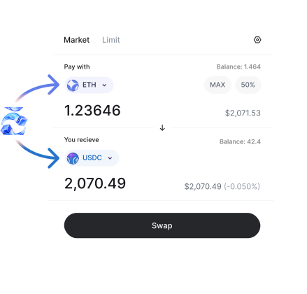
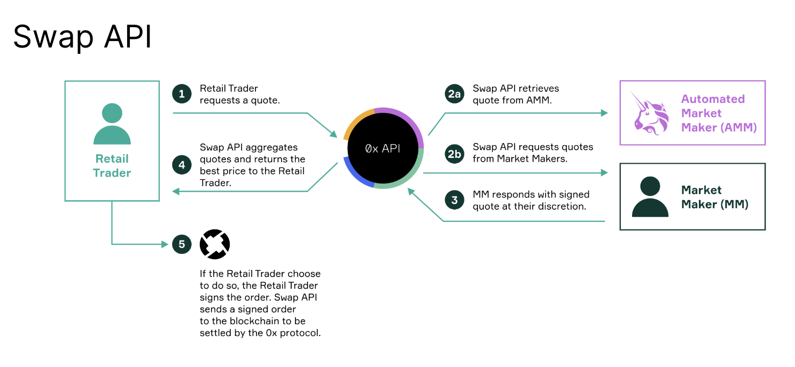

<Tip>
Prefer to watch a video or see a code demo instead? Jump to [0x Videos](https://www.youtube.com/playlist?list=PLN51Tjs40v5MpBMfGxxiML9x2sd0uD94D) or [0x Code Examples](https://github.com/0xProject/0x-examples).

</Tip>

## What is Swap API?

Swap API is a professional-grade DEX aggregation and smart order routing API that lets you add crypto trading with a single API. It sources the best real-time prices from 150+ public and private liquidity providers across [supported chains](/docs/introduction/supported-chains).



<Tip>
  Want to build a gasless trading app? Check out [Gasless
  API](/docs/gasless-api/introduction) instead.
</Tip>

## Why use Swap API?

Swap API is designed to protect your users, streamline integration for developers, and unlock new revenue opportunities for your team.

- ⛓️ **Multi-chain liquidity**: Tap into deep liquidity across major networks. See [supported chains](/docs/introduction/supported-chains).
- 🤑 **Built-in monetization**: [Earn fees](/docs/0x-swap-api/guides/monetize-your-app-using-swap) on every swap.
- 🛡️ **User protection**: Our smart contracts reduce allowance risk by supporting modern standards like [AllowanceHolder](/docs/core-concepts/contracts#allowanceholder-recommended) and [Permit2](/docs/core-concepts/contracts#permit2-advanced-use-only) for safer token approvals.
- ↩️ **Reliable execution**: We offer some of the [lowest revert rates](https://twitter.com/0xProject/status/1750927465483289000) in the industry.
- 💰 **Exclusive RFQ liquidity**: Access private, off-chain [RFQ quotes](http://localhost:3000/docs/0x-swap-api/advanced-topics/about-the-rfq-system) with **0 slippage**.
- 🚀 **Developer-friendly**: Easy to integrate, customizable, and designed to find the best price with a single request.

## Try it out

Run the request below to get a live quote for selling 100,000 WETH for DAI:

```bash
# Sell 100,000 WETH for DAI
# Taker address is vitalik.eth
# Replace "YOUR_API_KEY" with your actual API key from https://dashboard.0x.org/create-account
curl --request GET \
  --url "https://api.0x.org/swap/allowance-holder/quote?sellAmount=100000000000000000000000&taker=0xd8dA6BF26964aF9D7eEd9e03E53415D37aA96045&chainId=1&sellToken=0xc02aaa39b223fe8d0a0e5c4f27ead9083c756cc2&buyToken=0x6b175474e89094c44da98b954eedeac495271d0f" \
  --header "0x-api-key: YOUR_API_KEY" \
  --header "0x-version: v2"
```

You’ll receive an unsigned Ethereum transaction that can be [signed and submitted](/docs/introduction/quickstart/getting-started#4-submit-the-transaction) directly to a node.
Learn more about the response parameters in the [API docs](/api-reference/openapi-json/swap/allowanceholder-getprice).

<Accordion title="Expand to see response">
```bash
{
    "allowanceTarget": "0x0000000000001ff3684f28c67538d4d072c22734",
    "blockNumber": "23187566",
    "buyAmount": "235932519449815263461168645",
    "buyToken": "0x6b175474e89094c44da98b954eedeac495271d0f",
    "fees": {
        "integratorFee": null,
        "zeroExFee": {
            "amount": "326467223589357163093426",
            "token": "0x6b175474e89094c44da98b954eedeac495271d0f",
            "type": "volume"
        },
        "gasFee": null
    },
    "issues": {
        "allowance": {
            "actual": "0",
            "spender": "0x0000000000001ff3684f28c67538d4d072c22734"
        },
        "balance": {
            "token": "0xc02aaa39b223fe8d0a0e5c4f27ead9083c756cc2",
            "actual": "0",
            "expected": "100000000000000000000000"
        },
        "simulationIncomplete": false,
        "invalidSourcesPassed": []
    },
    "liquidityAvailable": true,
    "minBuyAmount": "233569649951068991418492945",
    "route": {
        "fills": [
            {
                "from": "0xc02aaa39b223fe8d0a0e5c4f27ead9083c756cc2",
                "to": "0x2260fac5e5542a773aa44fbcfedf7c193bc2c599",
                "source": "Uniswap_V3",
                "proportionBps": "250"
            },
            {
                "from": "0xc02aaa39b223fe8d0a0e5c4f27ead9083c756cc2",
                "to": "0x2260fac5e5542a773aa44fbcfedf7c193bc2c599",
                "source": "Uniswap_V3",
                "proportionBps": "250"
            },
            {
                "from": "0xc02aaa39b223fe8d0a0e5c4f27ead9083c756cc2",
                "to": "0x2260fac5e5542a773aa44fbcfedf7c193bc2c599",
                "source": "Curve",
                "proportionBps": "250"
            },
            {
                "from": "0xc02aaa39b223fe8d0a0e5c4f27ead9083c756cc2",
                "to": "0x2260fac5e5542a773aa44fbcfedf7c193bc2c599",
                "source": "Curve",
                "proportionBps": "250"
            },
            {
                "from": "0xc02aaa39b223fe8d0a0e5c4f27ead9083c756cc2",
                "to": "0x2260fac5e5542a773aa44fbcfedf7c193bc2c599",
                "source": "Uniswap_V4",
                "proportionBps": "250"
            },
            {
                "from": "0xc02aaa39b223fe8d0a0e5c4f27ead9083c756cc2",
                "to": "0x2260fac5e5542a773aa44fbcfedf7c193bc2c599",
                "source": "Uniswap_V2",
                "proportionBps": "250"
            },
            {
                "from": "0xc02aaa39b223fe8d0a0e5c4f27ead9083c756cc2",
                "to": "0x2260fac5e5542a773aa44fbcfedf7c193bc2c599",
                "source": "SushiSwap",
                "proportionBps": "500"
            },
            {
                "from": "0xc02aaa39b223fe8d0a0e5c4f27ead9083c756cc2",
                "to": "0x2260fac5e5542a773aa44fbcfedf7c193bc2c599",
                "source": "RingSwap",
                "proportionBps": "500"
            },
            {
                "from": "0xc02aaa39b223fe8d0a0e5c4f27ead9083c756cc2",
                "to": "0x6b175474e89094c44da98b954eedeac495271d0f",
                "source": "Uniswap_V3",
                "proportionBps": "250"
            },
            {
                "from": "0xc02aaa39b223fe8d0a0e5c4f27ead9083c756cc2",
                "to": "0x6b175474e89094c44da98b954eedeac495271d0f",
                "source": "Uniswap_V2",
                "proportionBps": "250"
            },
            {
                "from": "0xc02aaa39b223fe8d0a0e5c4f27ead9083c756cc2",
                "to": "0x6b175474e89094c44da98b954eedeac495271d0f",
                "source": "SushiSwap",
                "proportionBps": "250"
            },
            {
                "from": "0xc02aaa39b223fe8d0a0e5c4f27ead9083c756cc2",
                "to": "0xa0b86991c6218b36c1d19d4a2e9eb0ce3606eb48",
                "source": "Uniswap_V3",
                "proportionBps": "499"
            },
            {
                "from": "0xc02aaa39b223fe8d0a0e5c4f27ead9083c756cc2",
                "to": "0xa0b86991c6218b36c1d19d4a2e9eb0ce3606eb48",
                "source": "Uniswap_V3",
                "proportionBps": "249"
            },
            {
                "from": "0xc02aaa39b223fe8d0a0e5c4f27ead9083c756cc2",
                "to": "0xa0b86991c6218b36c1d19d4a2e9eb0ce3606eb48",
                "source": "Uniswap_V3",
                "proportionBps": "499"
            },
            {
                "from": "0xc02aaa39b223fe8d0a0e5c4f27ead9083c756cc2",
                "to": "0xa0b86991c6218b36c1d19d4a2e9eb0ce3606eb48",
                "source": "Curve",
                "proportionBps": "249"
            },
            {
                "from": "0xc02aaa39b223fe8d0a0e5c4f27ead9083c756cc2",
                "to": "0xa0b86991c6218b36c1d19d4a2e9eb0ce3606eb48",
                "source": "Uniswap_V4",
                "proportionBps": "249"
            },
            {
                "from": "0xc02aaa39b223fe8d0a0e5c4f27ead9083c756cc2",
                "to": "0xa0b86991c6218b36c1d19d4a2e9eb0ce3606eb48",
                "source": "Uniswap_V4",
                "proportionBps": "756"
            },
            {
                "from": "0xc02aaa39b223fe8d0a0e5c4f27ead9083c756cc2",
                "to": "0xa0b86991c6218b36c1d19d4a2e9eb0ce3606eb48",
                "source": "Uniswap_V2",
                "proportionBps": "499"
            },
            {
                "from": "0xc02aaa39b223fe8d0a0e5c4f27ead9083c756cc2",
                "to": "0xa0b86991c6218b36c1d19d4a2e9eb0ce3606eb48",
                "source": "Uniswap_V4",
                "proportionBps": "249"
            },
            {
                "from": "0xc02aaa39b223fe8d0a0e5c4f27ead9083c756cc2",
                "to": "0xdac17f958d2ee523a2206206994597c13d831ec7",
                "source": "Uniswap_V3",
                "proportionBps": "250"
            },
            {
                "from": "0xc02aaa39b223fe8d0a0e5c4f27ead9083c756cc2",
                "to": "0xdac17f958d2ee523a2206206994597c13d831ec7",
                "source": "Uniswap_V3",
                "proportionBps": "250"
            },
            {
                "from": "0xc02aaa39b223fe8d0a0e5c4f27ead9083c756cc2",
                "to": "0xdac17f958d2ee523a2206206994597c13d831ec7",
                "source": "Uniswap_V3",
                "proportionBps": "1251"
            },
            {
                "from": "0xc02aaa39b223fe8d0a0e5c4f27ead9083c756cc2",
                "to": "0xdac17f958d2ee523a2206206994597c13d831ec7",
                "source": "Uniswap_V4",
                "proportionBps": "250"
            },
            {
                "from": "0xc02aaa39b223fe8d0a0e5c4f27ead9083c756cc2",
                "to": "0xdac17f958d2ee523a2206206994597c13d831ec7",
                "source": "Uniswap_V2",
                "proportionBps": "1000"
            },
            {
                "from": "0xc02aaa39b223fe8d0a0e5c4f27ead9083c756cc2",
                "to": "0xdac17f958d2ee523a2206206994597c13d831ec7",
                "source": "PancakeSwap_V3",
                "proportionBps": "250"
            },
            {
                "from": "0xc02aaa39b223fe8d0a0e5c4f27ead9083c756cc2",
                "to": "0xf939e0a03fb07f59a73314e73794be0e57ac1b4e",
                "source": "Curve",
                "proportionBps": "250"
            },
            {
                "from": "0x2260fac5e5542a773aa44fbcfedf7c193bc2c599",
                "to": "0xdac17f958d2ee523a2206206994597c13d831ec7",
                "source": "Uniswap_V3",
                "proportionBps": "174"
            },
            {
                "from": "0x2260fac5e5542a773aa44fbcfedf7c193bc2c599",
                "to": "0xa0b86991c6218b36c1d19d4a2e9eb0ce3606eb48",
                "source": "Uniswap_V3",
                "proportionBps": "2036"
            },
            {
                "from": "0x2260fac5e5542a773aa44fbcfedf7c193bc2c599",
                "to": "0xa0b86991c6218b36c1d19d4a2e9eb0ce3606eb48",
                "source": "0x_RFQ",
                "proportionBps": "290"
            },
            {
                "from": "0xdac17f958d2ee523a2206206994597c13d831ec7",
                "to": "0x6b175474e89094c44da98b954eedeac495271d0f",
                "source": "Uniswap_V3",
                "proportionBps": "104"
            },
            {
                "from": "0xdac17f958d2ee523a2206206994597c13d831ec7",
                "to": "0x6b175474e89094c44da98b954eedeac495271d0f",
                "source": "Curve",
                "proportionBps": "2955"
            },
            {
                "from": "0xdac17f958d2ee523a2206206994597c13d831ec7",
                "to": "0xf939e0a03fb07f59a73314e73794be0e57ac1b4e",
                "source": "Curve",
                "proportionBps": "366"
            },
            {
                "from": "0xf939e0a03fb07f59a73314e73794be0e57ac1b4e",
                "to": "0xa0b86991c6218b36c1d19d4a2e9eb0ce3606eb48",
                "source": "Curve",
                "proportionBps": "616"
            },
            {
                "from": "0xa0b86991c6218b36c1d19d4a2e9eb0ce3606eb48",
                "to": "0x6b175474e89094c44da98b954eedeac495271d0f",
                "source": "Maker_PSM",
                "proportionBps": "6191"
            }
        ],
        "tokens": [
            {
                "address": "0xc02aaa39b223fe8d0a0e5c4f27ead9083c756cc2",
                "symbol": "WETH"
            },
            {
                "address": "0x2260fac5e5542a773aa44fbcfedf7c193bc2c599",
                "symbol": "WBTC"
            },
            {
                "address": "0xdac17f958d2ee523a2206206994597c13d831ec7",
                "symbol": "USDT"
            },
            {
                "address": "0xf939e0a03fb07f59a73314e73794be0e57ac1b4e",
                "symbol": "crvUSD"
            },
            {
                "address": "0xa0b86991c6218b36c1d19d4a2e9eb0ce3606eb48",
                "symbol": "USDC"
            },
            {
                "address": "0x6b175474e89094c44da98b954eedeac495271d0f",
                "symbol": "DAI"
            }
        ]
    },
    "sellAmount": "100000000000000000000000",
    "sellToken": "0xc02aaa39b223fe8d0a0e5c4f27ead9083c756cc2",
    "tokenMetadata": {
        "buyToken": {
            "buyTaxBps": "0",
            "sellTaxBps": "0"
        },
        "sellToken": {
            "buyTaxBps": "0",
            "sellTaxBps": "0"
        }
    },
    "totalNetworkFee": "31754911939128290",
    "transaction": {
        "to": "0x0000000000001ff3684f28c67538d4d072c22734",
        "data": "0x2213bc0b000000000000000000000000df31a70a21a1931e02033dbba7deace6c45...truncated...",
        "gas": "87021770",
        "gasPrice": "364907677",
        "value": "0"
    },
    "zid": "0xf7107a43f9382b57c6b0c4e7"
}
```
</Accordion>

## How does it work?

Swap API is a professional-grade DEX aggregator and smart order-routing API. It pulls prices from 150+ liquidity sources—both public AMMs and private market makers—across multiple blockchains to return the best executable price.

Below is a high-level diagram showing how Swap API works under the hood:



<Steps>
  <Step>A user requests a quote.</Step>
  <Step>
    Swap API simultaneously (a) fetches a quote from AMM and (b) requests quotes
    from market makers.
  </Step>
  <Step>Market makers respond with signed quotes at their discretion.</Step>
  <Step>
    Swap API aggregates all quotes, compares them, and returns the best price.
  </Step>
  <Step>
    If the user accepts, the signed order is submitted on-chain and settled via
    0x.
  </Step>
</Steps>
For more details about how 0x orders are executed, check out [How does 0x
work?](/docs/core-concepts/introduction-to-0x#how-does-0x-work)

Under the hood, Swap API performs a series of tasks:

- **Queries prices** from multiple DEXs and market makers and **aggregates the liquidity** from the queried sources to provide the best price possible. Think of how Google flights aggregates flight prices for a certain time and date to help you find the best price, `/swap` similarly helps you find the best price across DeFi liquidity sources.
- Swap API’s **smart order routing** algorithm splits up your transaction across different sources to maximize the overall return on your swap. Read more about smart order routing [here](https://medium.com/@merklejerk/0x-apis-smart-order-routing-7af0195515e5).
- The response returned by Swap API is a valid unsigned Ethereum transaction that can be signed and submitted directly to an Ethereum node. **[Easily execute using the transaction using the web3 library of your choice](/docs/0x-swap-api/guides/swap-tokens-with-0x-swap-api#4-submit-the-transaction)**.

## Supported Chains

Swap API supports multiple blockchain networks. Refer to the [Supported Chains](/docs/introduction/supported-chains) page for the full list of currently supported networks and chain IDs.

## Get Started

Create an account and get live API keys on the [0x Dashboard](https://dashboard.0x.org/apps).

Next, [Get Started with Swap API](/docs/0x-swap-api/guides/swap-tokens-with-0x-swap-api)
