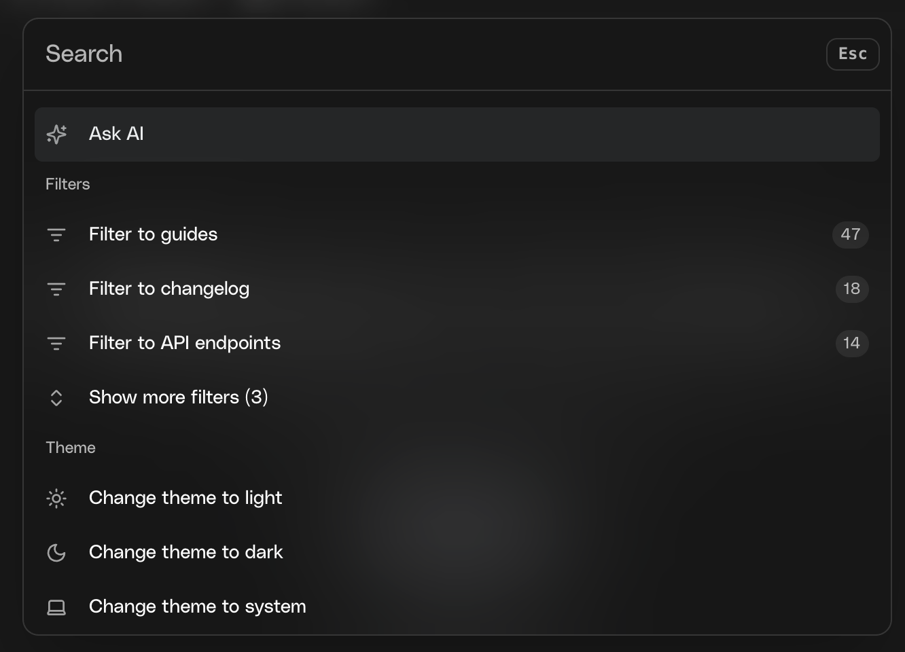
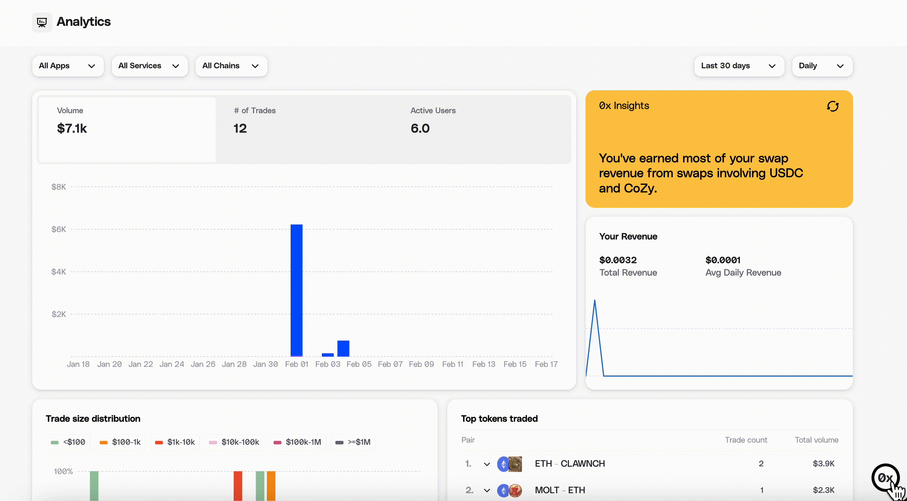

Need help with 0x? We provide search, AI tools, and direct support options.

## 🔎 Search the Docs (Recommended First Step)

Before reaching out, try using our built-in AI-powered documentation search.

You can:

- Ask questions using **Ask AI**
- Run traditional keyword searches
- Search directly from the widget in the docs

For advanced AI workflows, see **[Using AI with 0x](/docs/introduction/develop-with-ai/using-ai-with-0x)** to connect LLMs directly to 0x documentation.

---

## 💬 Contact Developer Support (Fastest Direct Help)

The 0x Developer Support team is available to answer technical questions.

The **fastest route for technical support** is the Pylon messenger.

You can access it directly from your [0x Dashboard](https://dashboard.0x.org/)

---

---

## 🤖 Use AI with 0x Docs

0x Docs includes built-in tools to work efficiently with LLMs like ChatGPT, Claude, and Cursor.

You can:

- Copy documentation in AI-optimized format
- Open pages directly in ChatGPT or Claude
- Connect AI tools to the 0x MCP server
- Use AI-powered search inside your IDE

**[Learn how to use AI with 0x](/docs/introduction/develop-with-ai/using-ai-with-0x)**

---

## 💡 Submit a Feature Request

Have an idea to improve 0x APIs or tooling?

We welcome product feedback and feature suggestions from developers building with 0x.

👉 **[Submit a Feature Request](https://help.0x.org/articles/6482251154-how-to-submit-a-0x-feature-request)**

---

## 💼 Contact Sales

Questions about plans, pricing, enterprise contracts, or demos?

[Speak to our Sales team](https://0x.org/contact)

---

## 💬 Community (Discord)

Join our [Discord](https://discord.com/invite/official0x) to connect with other developers building with 0x APIs.

> Note: For account-specific or technical issues, Pylon Messenger support via the 0x Dashboard is the fastest option.

---

## 📢 Stay Updated

Follow 0x for announcements and updates:

- [X](https://x.com/0xProject)
- [YouTube](https://www.youtube.com/c/0xProject)
- [Warpcast](https://warpcast.com/0xproject)
