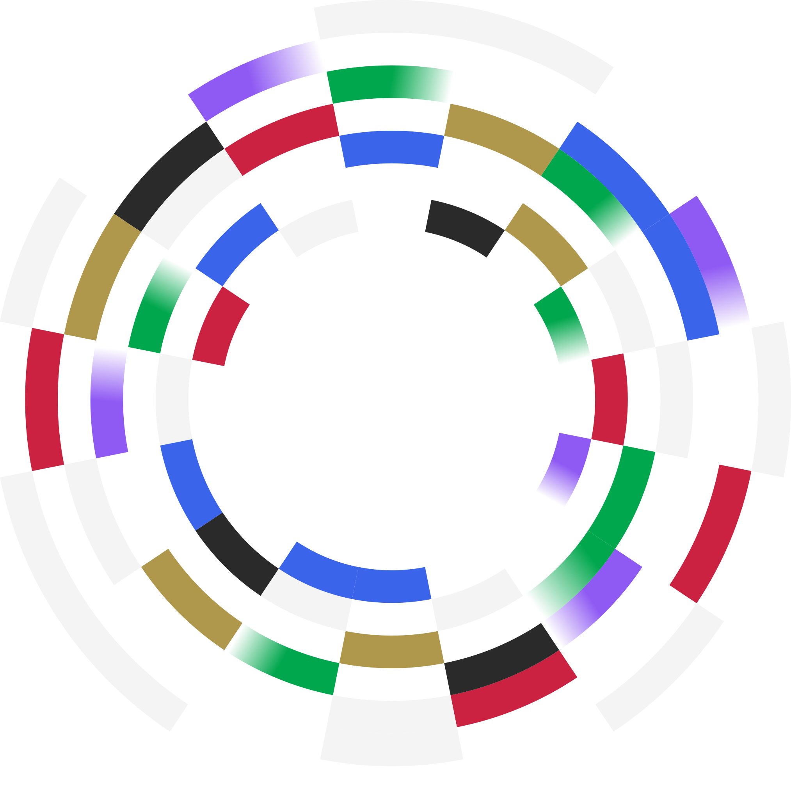

{/* ── Hero ── */}

  

    <h1
      style={{
        fontSize: "3.25rem",
        fontWeight: "400",
        marginBottom: "0.75rem",
        lineHeight: 1.1,
      }}
    >
      Welcome to 0x Docs
    </h1>
    

      Build onchain trading into your app. Liquidity from 150+ sources, across
      EVM chains and Solana — with a single API.
    

    

      <a
        href="/overview/introduction/quickstart/swap-tokens-with-0x-swap-api"
        className="hero-btn-primary"
      >
        Start building →
      </a>
      <a
        href="https://github.com/0xProject/0x-examples"
        className="hero-btn-secondary"
      >
        Explore demo projects →
      </a>
    

  

  

    
    
  

{/* ── Explore 0x APIs ── */}

<h2 style={{ textAlign: "center" }}>Explore 0x APIs</h2>

<CardGroup cols={3}>

<Card title="EVM Swap API" href="/evm/0x-swap-api/introduction" icon="shuffle">
  Embed token swaps on any EVM chain. Aggregated liquidity from 150+ sources.
</Card>

<Card
  title="Solana Swap API"
  href="/svm/solana-swap-api/introduction"
  icon="sun"
>
  Native Solana support. Fast, low-cost token swaps with deep SPL token
  liquidity.
</Card>

<Card
  title="Cross-Chain API"
  href="/cross-chain/cross-chain-api/introduction"
  icon="bridge"
>
  Swap any token across any chain in one transaction.
</Card>

<Card title="Gasless API" href="/evm/gasless-api/introduction" icon="gas-pump">
  Enable seamless, gasless DeFi transactions.
</Card>

<Card
  title="Trade Analytics API"
  href="/evm/trade-analytics-api/introduction"
  icon="chart-bar"
>
  Track and analyze trades routed through 0x.
</Card>

</CardGroup>

{/* ── Quick Links ── */}

<h2 style={{ textAlign: "center" }}>Quick Links</h2>

<CardGroup cols={4}>

<Card
  title="Build with AI"
  href="/overview/introduction/using-ai-with-0x"
  icon="microchip"
>
  Accelerate your 0x integration using AI tools
</Card>

<Card
  title="Build with Swap API"
  href="/evm/0x-swap-api/guides/swap-tokens-with-0x-swap-api"
  icon="hammer"
>
  Get started with Swap API
</Card>

<Card
  title="Code Examples"
  href="https://github.com/0xProject/0x-examples"
  icon="code"
>
  Ready-to-use 0x code examples
</Card>

<Card
  title="Monetize your app"
  href="/evm/0x-swap-api/guides/monetize-your-app-using-swap"
  icon="dollar-sign"
>
  Unlock new revenue streams with 0x
</Card>

</CardGroup>

{/* ── Release Highlights ── */}

<h2 style={{ textAlign: "center" }}>Release Highlights</h2>

| Date       | Update                                                                                                                                              | API                   |
| ---------- | --------------------------------------------------------------------------------------------------------------------------------------------------- | --------------------- |
| May 2026   | [Exact-out support — specify a precise `buyAmount` and get the minimum sell amount required](https://docs.0x.org/changelog#2026-05-31-new-features) | Swap API, Gasless API |
| May 2026   | [Concurrent gasless trades now supported for the same taker and sell token](https://docs.0x.org/changelog#2026-05-31-new-features)                  | Gasless API           |
| April 2026 | [New 0x Agent Skill for AI-powered integrations](https://docs.0x.org/changelog#2026-04-30-new-feature)                                              | All APIs              |
| April 2026 | [Sub-BPS slippage precision now supported](https://docs.0x.org/changelog#2026-04-30-new-feature)                                                    | Swap API, Gasless API |
| March 2026 | [Smart account signatures now supported](https://docs.0x.org/changelog#2026-04-13-new-features)                                                     | Gasless API           |
| March 2026 | [Fine-tuned native wrap/unwrap control via `wrapUnwrapMode`](https://docs.0x.org/changelog#2026-04-13-new-features)                                 | Swap API              |

<a
  href="/changelog"
  style={{ display: "block", textAlign: "center", marginTop: "0.5rem" }}
>
  See all updates →
</a>

{/* ── Resources ── */}

<h2 style={{ textAlign: "center" }}>Resources</h2>

<CardGroup cols={2}>

<Card
  title="0x Cheat Sheet"
  href="/overview/core-concepts/0x-cheat-sheet"
  icon="book"
>
  Quick reference for supported chains & contract addresses
</Card>

<Card title="0x System Status" href="https://0x.statuspal.io" icon="signal">
  Real-time 0x system performance updates
</Card>

<Card
  title="Rate Limits"
  href="/overview/developer-resources/rate-limits"
  icon="gauge"
>
  Understand 0x API rate limits
</Card>

<Card title="0x Dashboard" href="https://dashboard.0x.org" icon="chart-line">
  Manage your API keys and monitor usage
</Card>

</CardGroup>

{/* ── Help ── */}

<h2 style={{ textAlign: "center" }}>Need Help?</h2>

<CardGroup cols={2}>

<Card title="FAQ" href="/overview/introduction/faq" icon="wrench">
  Answers to common integration issues
</Card>

<Card
  title="Support"
  href="/overview/introduction/need-help#-contact-developer-support-fastest-direct-help"
  icon="life-ring"
>
  Contact the 0x developer support team
</Card>

</CardGroup>
