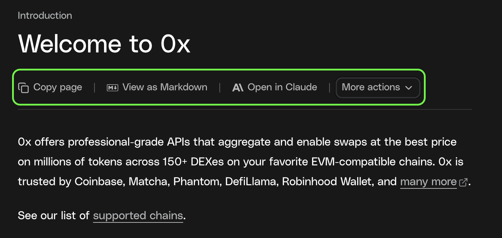

0x Docs includes several built-in tools designed to make it easy to use large language models (LLMs) with accurate, structured documentation context. These tools help you ask better questions, debug faster, and explore integrations without manually cleaning up content.

All options are available from the **page actions menu** on any documentation page, located next to the page title.



## Get started

<CardGroup cols={3}>
  <Card
    title="Use an LLM"
    href="/docs/introduction/develop-with-ai/overview#copy-page"
    icon="brain"
  >
    Use 0x docs directly in your AI workflow with context-menu copy options, direct AI tool integrations, and one-click IDE setup.
  </Card>

{" "}
<Card
  title="Connect to the 0x MCP Server"
  href="/docs/introduction/develop-with-ai/overview#connect-to-cursor-mcp"
  icon="plug"
>
  Give AI tools searchable access to 0x documentation to generate more accurate,
  up-to-date code.
</Card>

  <Card
    title="AI Projects with 0x"
    href="/docs/introduction/develop-with-ai/ai-tools"
    icon="robot"
  >
    Explore consumer and developer tools using AI and 0x in production.
  </Card>
</CardGroup>

## Available Options

Below is a list of all available options, what they do, and when to use them.

### Copy Page

Copies the page in a format optimized for AI tools.

- Preserves structure and code blocks
- Removes UI and navigation noise

**When to use**  
Paste into any LLM to ask questions or generate code using the current page as context.

**How to use**  
Select **Copy page**, then paste into your AI tool.

---

### View as Markdown

Shows the raw Markdown source of the page.

**When to use**  
Inspect, edit, or selectively share content before sending it to an AI tool.

**How to use**  
Select **View as Markdown**, then copy what you need.

---

### Ask AI

Ask questions about the current page directly in the docs.

**When to use**  
Get quick explanations without leaving the documentation site.

**How to use**  
Select **Ask AI** and enter your question.

---

### Open in ChatGPT

Opens the page in ChatGPT with context included.

**When to use**  
Quick Q&A or code generation based on a single page.

**How to use**  
Select **Open in ChatGPT** to continue in ChatGPT.

---

### Open in Claude

Opens the page in Claude with full context.

**When to use**  
Deeper analysis or longer-form reasoning about the page.

**How to use**  
Select **Open in Claude** to continue in Claude.

---

### Connect to Cursor (MCP)

Connect 0x documentation to Cursor using the Model Context Protocol (MCP) to enable AI-powered search and assistance directly in your editor.

<Tabs>
  <Tab title="Automatic (Recommended)">

The fastest way to connect MCP to Cursor.

  <Steps>
    <Step title="Connect to Cursor">
      On any CDP documentation page, open the **Copy page** dropdown next to the page header.  
      Select **Connect to Cursor**.  
      Cursor will automatically open with the CDP MCP server configured.
    </Step>

    <Step title="Test the connection">
      In Cursor’s chat, ask: **“What tools do you have available?”**

      Cursor should confirm access to 0x documentation search and configured API endpoints.
    </Step>

  </Steps>

  </Tab>

  <Tab title="Manual configuration">

Use this option if you prefer explicit setup or need to troubleshoot.

  <Steps>
    <Step title="Open MCP settings">
      Open Cursor and press `Cmd + Shift + P` (`Ctrl + Shift + P` on Windows).  
      Search for **Open MCP settings**.  
      Select **Open MCP settings** to open `mcp.json`.
    </Step>

    <Step title="Configure the CDP server">
      Add the following configuration to `mcp.json`:

      ```json title="mcp.json"
      {
        "mcpServers": {
          "0x": {
            "url": "https://docs.0x.org/_mcp/server"
          }
        }
      }
      ```
    </Step>

    <Step title="Test the connection">
      In Cursor’s chat, ask: **“Do you have access to an MCP server?”**

      Cursor should confirm access to CDP documentation search and any configured API endpoints.
    </Step>

  </Steps>

  </Tab>
</Tabs>
