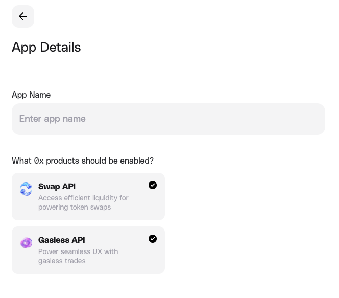

## 1. Create a 0x Account

To create an account on the [0x Dashboard](https://dashboard.0x.org/apps), click **Sign Up**, enter your name, email address and password, and click **Continue**

<Frame>
  
</Frame>

## 2. Create a Team

Once verified, you'll be prompted to create a team on 0x. Decide on a team name and select the type of project you are building. You can share this account with your teammates.

<Frame>
  
</Frame>

## 3. Tour the Dashboard

### 3.1 Create an App

Click **Create an app** to get a live API key that has access to multiple 0x products.

<Frame>
  
</Frame>

From the pop-up, enter your app's name and which 0x products (Swap API and Gasless API) should be enabled for this API key, then click **Continue**.

<Note>
  You can still update which 0x products this key can access even after the app
  is created.
</Note>

<Frame>
  
</Frame>

### 3.2 Reveal Your API Key

This key is unique and tied to your app. **Do not share it**. You can also create additional API keys for the app if you need them.

Your API keys will allow you to authenticate requests on 0x. Remember to specify the key in your requests via the `0x-api-key` header parameter:

<Frame>
  
</Frame>

### 3.3 Make Your First 0x API Call

Run this curl request to see a live quote response for selling 100,000 WETH to buy DAI on Ethereum Mainnet:

```bash
// Sell 100,000 WETH for DAI
// Taker address is vitalik.eth
// Replace "YOUR_API_KEY" with your actual API key from https://dashboard.0x.org/create-account
curl --request GET \
  --url "https://api.0x.org/swap/permit2/quote?sellAmount=100000000000000000000000&taker=0xd8dA6BF26964aF9D7eEd9e03E53415D37aA96045&chainId=1&sellToken=0xc02aaa39b223fe8d0a0e5c4f27ead9083c756cc2&buyToken=0x6b175474e89094c44da98b954eedeac495271d0f" \
  --header "0x-api-key: YOUR_API_KEY" \
  --header "0x-version: v2"
```

You will receive a response that looks like this:

<Accordion title="Expand to see response">
```bash
{
    "blockNumber": "21876249",
    "buyAmount": "145110588712348756365465945",
    "buyToken": "0x6b175474e89094c44da98b954eedeac495271d0f",
    "fees": {
        "integratorFee": null,
        "zeroExFee": {
            "amount": "207515265570963324735062",
            "token": "0x6b175474e89094c44da98b954eedeac495271d0f",
            "type": "volume"
        },
        "gasFee": null
    },
    "issues": {
        "allowance": {
            "actual": "0",
            "spender": "0x000000000022d473030f116ddee9f6b43ac78ba3"
        },
        "balance": {
            "token": "0xc02aaa39b223fe8d0a0e5c4f27ead9083c756cc2",
            "actual": "16320309787715287566",
            "expected": "100000000000000000000000"
        },
        "simulationIncomplete": false,
        "invalidSourcesPassed": []
    },
    "liquidityAvailable": true,
    "minBuyAmount": "143659482825225268801805400",
    "permit2": {
        "type": "Permit2",
        "hash": "0xafb2c83591d83ec04d0792eaa00d36f5a509dfab6666fa787e310afa276bf379",
        "eip712": {
            "types": {
                "PermitTransferFrom": [
                    {
                        "name": "permitted",
                        "type": "TokenPermissions"
                    },
                    {
                        "name": "spender",
                        "type": "address"
                    },
                    {
                        "name": "nonce",
                        "type": "uint256"
                    },
                    {
                        "name": "deadline",
                        "type": "uint256"
                    }
                ],
                "TokenPermissions": [
                    {
                        "name": "token",
                        "type": "address"
                    },
                    {
                        "name": "amount",
                        "type": "uint256"
                    }
                ],
                "EIP712Domain": [
                    {
                        "name": "name",
                        "type": "string"
                    },
                    {
                        "name": "chainId",
                        "type": "uint256"
                    },
                    {
                        "name": "verifyingContract",
                        "type": "address"
                    }
                ]
            },
            "domain": {
                "name": "Permit2",
                "chainId": 1,
                "verifyingContract": "0x000000000022d473030f116ddee9f6b43ac78ba3"
            },
            "message": {
                "permitted": {
                    "token": "0xc02aaa39b223fe8d0a0e5c4f27ead9083c756cc2",
                    "amount": "100000000000000000000000"
                },
                "spender": "0x0d0e364aa7852291883c162b22d6d81f6355428f",
                "nonce": "2241959297937691820908574931991559",
                "deadline": "1739918089"
            },
            "primaryType": "PermitTransferFrom"
        }
    },
    "route": {
        "fills": [
            {
                "from": "0xc02aaa39b223fe8d0a0e5c4f27ead9083c756cc2",
                "to": "0x2260fac5e5542a773aa44fbcfedf7c193bc2c599",
                "source": "Uniswap_V3",
                "proportionBps": "250"
            },
            {
                "from": "0xc02aaa39b223fe8d0a0e5c4f27ead9083c756cc2",
                "to": "0x2260fac5e5542a773aa44fbcfedf7c193bc2c599",
                "source": "Uniswap_V3",
                "proportionBps": "749"
            },
            {
                "from": "0xc02aaa39b223fe8d0a0e5c4f27ead9083c756cc2",
                "to": "0x2260fac5e5542a773aa44fbcfedf7c193bc2c599",
                "source": "Curve",
                "proportionBps": "250"
            },
            {
                "from": "0xc02aaa39b223fe8d0a0e5c4f27ead9083c756cc2",
                "to": "0x2260fac5e5542a773aa44fbcfedf7c193bc2c599",
                "source": "Curve",
                "proportionBps": "250"
            },
            {
                "from": "0xc02aaa39b223fe8d0a0e5c4f27ead9083c756cc2",
                "to": "0x2260fac5e5542a773aa44fbcfedf7c193bc2c599",
                "source": "SushiSwap",
                "proportionBps": "500"
            },
            {
                "from": "0xc02aaa39b223fe8d0a0e5c4f27ead9083c756cc2",
                "to": "0x2260fac5e5542a773aa44fbcfedf7c193bc2c599",
                "source": "Uniswap_V2",
                "proportionBps": "251"
            },
            {
                "from": "0xc02aaa39b223fe8d0a0e5c4f27ead9083c756cc2",
                "to": "0x6b175474e89094c44da98b954eedeac495271d0f",
                "source": "Uniswap_V3",
                "proportionBps": "250"
            },
            {
                "from": "0xc02aaa39b223fe8d0a0e5c4f27ead9083c756cc2",
                "to": "0x6b175474e89094c44da98b954eedeac495271d0f",
                "source": "SushiSwap",
                "proportionBps": "250"
            },
            {
                "from": "0xc02aaa39b223fe8d0a0e5c4f27ead9083c756cc2",
                "to": "0x6b175474e89094c44da98b954eedeac495271d0f",
                "source": "Uniswap_V2",
                "proportionBps": "500"
            },
            {
                "from": "0xc02aaa39b223fe8d0a0e5c4f27ead9083c756cc2",
                "to": "0xa0b86991c6218b36c1d19d4a2e9eb0ce3606eb48",
                "source": "Uniswap_V3",
                "proportionBps": "499"
            },
            {
                "from": "0xc02aaa39b223fe8d0a0e5c4f27ead9083c756cc2",
                "to": "0xa0b86991c6218b36c1d19d4a2e9eb0ce3606eb48",
                "source": "Uniswap_V3",
                "proportionBps": "749"
            },
            {
                "from": "0xc02aaa39b223fe8d0a0e5c4f27ead9083c756cc2",
                "to": "0xa0b86991c6218b36c1d19d4a2e9eb0ce3606eb48",
                "source": "Uniswap_V3",
                "proportionBps": "249"
            },
            {
                "from": "0xc02aaa39b223fe8d0a0e5c4f27ead9083c756cc2",
                "to": "0xa0b86991c6218b36c1d19d4a2e9eb0ce3606eb48",
                "source": "Uniswap_V2",
                "proportionBps": "1583"
            },
            {
                "from": "0xc02aaa39b223fe8d0a0e5c4f27ead9083c756cc2",
                "to": "0xa0b86991c6218b36c1d19d4a2e9eb0ce3606eb48",
                "source": "SushiSwap",
                "proportionBps": "499"
            },
            {
                "from": "0xc02aaa39b223fe8d0a0e5c4f27ead9083c756cc2",
                "to": "0xa0b86991c6218b36c1d19d4a2e9eb0ce3606eb48",
                "source": "Fluid",
                "proportionBps": "249"
            },
            {
                "from": "0xc02aaa39b223fe8d0a0e5c4f27ead9083c756cc2",
                "to": "0xa0b86991c6218b36c1d19d4a2e9eb0ce3606eb48",
                "source": "Uniswap_V4",
                "proportionBps": "250"
            },
            {
                "from": "0xc02aaa39b223fe8d0a0e5c4f27ead9083c756cc2",
                "to": "0xf939e0a03fb07f59a73314e73794be0e57ac1b4e",
                "source": "Curve",
                "proportionBps": "250"
            },
            {
                "from": "0xc02aaa39b223fe8d0a0e5c4f27ead9083c756cc2",
                "to": "0xdac17f958d2ee523a2206206994597c13d831ec7",
                "source": "Uniswap_V3",
                "proportionBps": "250"
            },
            {
                "from": "0xc02aaa39b223fe8d0a0e5c4f27ead9083c756cc2",
                "to": "0xdac17f958d2ee523a2206206994597c13d831ec7",
                "source": "Uniswap_V3",
                "proportionBps": "750"
            },
            {
                "from": "0xc02aaa39b223fe8d0a0e5c4f27ead9083c756cc2",
                "to": "0xdac17f958d2ee523a2206206994597c13d831ec7",
                "source": "Uniswap_V3",
                "proportionBps": "250"
            },
            {
                "from": "0xc02aaa39b223fe8d0a0e5c4f27ead9083c756cc2",
                "to": "0xdac17f958d2ee523a2206206994597c13d831ec7",
                "source": "PancakeSwap_V3",
                "proportionBps": "250"
            },
            {
                "from": "0xc02aaa39b223fe8d0a0e5c4f27ead9083c756cc2",
                "to": "0xdac17f958d2ee523a2206206994597c13d831ec7",
                "source": "Uniswap_V2",
                "proportionBps": "750"
            },
            {
                "from": "0xc02aaa39b223fe8d0a0e5c4f27ead9083c756cc2",
                "to": "0xdac17f958d2ee523a2206206994597c13d831ec7",
                "source": "0x_RFQ",
                "proportionBps": "83"
            },
            {
                "from": "0xc02aaa39b223fe8d0a0e5c4f27ead9083c756cc2",
                "to": "0xdac17f958d2ee523a2206206994597c13d831ec7",
                "source": "0x_RFQ",
                "proportionBps": "84"
            },
            {
                "from": "0xdac17f958d2ee523a2206206994597c13d831ec7",
                "to": "0x6b175474e89094c44da98b954eedeac495271d0f",
                "source": "Curve",
                "proportionBps": "1942"
            },
            {
                "from": "0xdac17f958d2ee523a2206206994597c13d831ec7",
                "to": "0xf939e0a03fb07f59a73314e73794be0e57ac1b4e",
                "source": "Curve",
                "proportionBps": "323"
            },
            {
                "from": "0xdac17f958d2ee523a2206206994597c13d831ec7",
                "to": "0x2260fac5e5542a773aa44fbcfedf7c193bc2c599",
                "source": "Uniswap_V3",
                "proportionBps": "86"
            },
            {
                "from": "0xdac17f958d2ee523a2206206994597c13d831ec7",
                "to": "0x2260fac5e5542a773aa44fbcfedf7c193bc2c599",
                "source": "0x_RFQ",
                "proportionBps": "21"
            },
            {
                "from": "0xdac17f958d2ee523a2206206994597c13d831ec7",
                "to": "0x2260fac5e5542a773aa44fbcfedf7c193bc2c599",
                "source": "0x_RFQ",
                "proportionBps": "21"
            },
            {
                "from": "0xdac17f958d2ee523a2206206994597c13d831ec7",
                "to": "0x2260fac5e5542a773aa44fbcfedf7c193bc2c599",
                "source": "0x_RFQ",
                "proportionBps": "22"
            },
            {
                "from": "0x2260fac5e5542a773aa44fbcfedf7c193bc2c599",
                "to": "0x6b175474e89094c44da98b954eedeac495271d0f",
                "source": "0x_RFQ",
                "proportionBps": "57"
            },
            {
                "from": "0x2260fac5e5542a773aa44fbcfedf7c193bc2c599",
                "to": "0x6b175474e89094c44da98b954eedeac495271d0f",
                "source": "0x_RFQ",
                "proportionBps": "57"
            },
            {
                "from": "0x2260fac5e5542a773aa44fbcfedf7c193bc2c599",
                "to": "0xa0b86991c6218b36c1d19d4a2e9eb0ce3606eb48",
                "source": "Uniswap_V3",
                "proportionBps": "38"
            },
            {
                "from": "0x2260fac5e5542a773aa44fbcfedf7c193bc2c599",
                "to": "0xa0b86991c6218b36c1d19d4a2e9eb0ce3606eb48",
                "source": "Uniswap_V3",
                "proportionBps": "1696"
            },
            {
                "from": "0x2260fac5e5542a773aa44fbcfedf7c193bc2c599",
                "to": "0xa0b86991c6218b36c1d19d4a2e9eb0ce3606eb48",
                "source": "Curve",
                "proportionBps": "343"
            },
            {
                "from": "0x2260fac5e5542a773aa44fbcfedf7c193bc2c599",
                "to": "0xa0b86991c6218b36c1d19d4a2e9eb0ce3606eb48",
                "source": "0x_RFQ",
                "proportionBps": "133"
            },
            {
                "from": "0x2260fac5e5542a773aa44fbcfedf7c193bc2c599",
                "to": "0xa0b86991c6218b36c1d19d4a2e9eb0ce3606eb48",
                "source": "0x_RFQ",
                "proportionBps": "19"
            },
            {
                "from": "0x2260fac5e5542a773aa44fbcfedf7c193bc2c599",
                "to": "0xa0b86991c6218b36c1d19d4a2e9eb0ce3606eb48",
                "source": "0x_RFQ",
                "proportionBps": "58"
            },
            {
                "from": "0xf939e0a03fb07f59a73314e73794be0e57ac1b4e",
                "to": "0xa0b86991c6218b36c1d19d4a2e9eb0ce3606eb48",
                "source": "Curve",
                "proportionBps": "573"
            },
            {
                "from": "0xa0b86991c6218b36c1d19d4a2e9eb0ce3606eb48",
                "to": "0x6b175474e89094c44da98b954eedeac495271d0f",
                "source": "Maker_PSM",
                "proportionBps": "6944"
            }
        ],
        "tokens": [
            {
                "address": "0xc02aaa39b223fe8d0a0e5c4f27ead9083c756cc2",
                "symbol": "WETH"
            },
            {
                "address": "0xdac17f958d2ee523a2206206994597c13d831ec7",
                "symbol": "USDT"
            },
            {
                "address": "0x2260fac5e5542a773aa44fbcfedf7c193bc2c599",
                "symbol": "WBTC"
            },
            {
                "address": "0xf939e0a03fb07f59a73314e73794be0e57ac1b4e",
                "symbol": "crvUSD"
            },
            {
                "address": "0xa0b86991c6218b36c1d19d4a2e9eb0ce3606eb48",
                "symbol": "USDC"
            },
            {
                "address": "0x6b175474e89094c44da98b954eedeac495271d0f",
                "symbol": "DAI"
            }
        ]
    },
    "sellAmount": "100000000000000000000000",
    "sellToken": "0xc02aaa39b223fe8d0a0e5c4f27ead9083c756cc2",
    "tokenMetadata": {
        "buyToken": {
            "buyTaxBps": "0",
            "sellTaxBps": "0"
        },
        "sellToken": {
            "buyTaxBps": "0",
            "sellTaxBps": "0"
        }
    },
    "totalNetworkFee": "54779430334381092",
    "transaction": {
        "to": "0x0d0e364aa7852291883c162b22d6d81f6355428f",
        "data": "0x1fff991f000000000000000000000000d8da6bf26964af9d7eed9e03e53415d37aa...truncated...",
        "gas": "53043726",
        "gasPrice": "1032722142",
        "value": "0"
    },
    "zid": "0x4394c57eeb18c52d02b7516f"
}
```
</Accordion>

This is a valid unsigned Ethereum transaction that can be [signed and submitted directly to a node](/docs/swap-api/guides/swap-tokens-with-swap-api#4-send-the-transaction-to-the-network) to complete the swap. Read more about the parameters [here](https://0x.org/docs/api#tag/Swap).

To find a list of all networks supported by 0x, check out the [0x Cheat Sheet](https://0x.org/docs/core-concepts/0-x-cheat-sheet).

## 4. Manage Your App

From the main dashboard screen, you can see all the apps you have created:

<Frame>
  
</Frame>

Click on an App to open up details about its API request health:

<Frame>
  
</Frame>

For each App, you can see the following:

<Steps>
  <Step>
    Which **0x products are enabled for your API key** - Swap API and Gasless
    API
  </Step>
  <Step>
    From **API Key**, **see all the API keys** associated with this app and
    **create or delete keys**.
  </Step>
  <Step>
    From **Settings**, change the 0x products enabled for this app. Set your
    **0x Explorer Tag**. Change the **App Name**.
  </Step>
  <Step>
    Toggle to view the **total API requests** and the **API error rate** for
    this app.
  </Step>
</Steps>
## 5. Manage Your Account

You can find additional settings to manage your account from **Your Account Avatar** in the top-right corner.

<Frame>
  
</Frame>

- **Settings** - You can see your full name, team name, and account email, as well as change your password.
- **Docs** - Jump into our [developer docs](https://0x.org/docs) and start building
- **Help Center** - Need help? Check out our commonly asked questions in the help center.
- **Trade Analytics API** - [Trade Analytics API](https://0x.org/docs/category/trade-analytics-api) offers programmatic access to historical trades initiated through your apps via 0x Swap and Gasless APIs. Formatted for direct analytics use, this data enables you to derive actionable insights and business intelligence from your app's trading activity.

The response includes comprehensive details for each trade, including the transaction hash, allowing you to verify the data on-chain.

## 6. Have a Question?

If you are logged-in to the [0x Dashboard](https://dashboard.0x.org/apps), you have a direct line to our team via the Pylon Messenger for Developer Support in the bottom right of the dashboard.


Additionally, the [0x Help Center](https://help.0x.org/) is a great place to start if you have questions about 0x subscriptions, integration best practicies, and troubleshooting guides.

## 7. Start Building

Now that you have a live API key, dive into our building resources and start building!

<CardGroup>
<Card title="Swap API" href="/docs/swap-api/introduction" icon="rotate">
Easily add crypto trading with one API, accessing 150+ exchanges and thousands of tokens.
</Card>

<Card title="Gasless API" href="/docs/gasless-api/introduction" icon="gas-pump">
  Enable seamless DeFi transactions by abstracting gas and token approvals.
</Card>

<Card
  title="Trade Analytics API"
  href="/docs/trade-analytics-api/introduction"
  icon="chart-simple"
>
  Access actionable insights from historical trades executed through your apps.
</Card>

<Card
  title="Core Concepts"
  href="/docs/core-concepts/introduction-to-0-x"
  icon="books"
>
  Learn about the fundamentals of 0x.
</Card>

</CardGroup>
